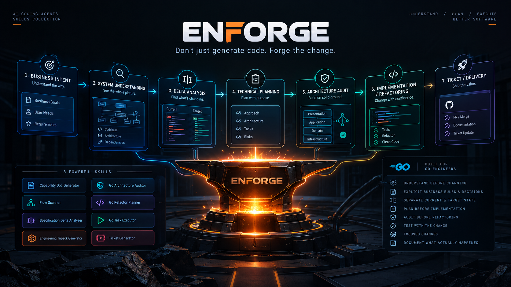

# ENFORGE

<p align="center">
  
</p>

> Don't just generate code. Forge the change.

**Engineering skills for turning business intent into structured, traceable, and implementation-ready software changes.**

ENFORGE is a collection of reusable skills for AI coding agents that helps engineers move from **business intent and system understanding to technical planning, architecture review, implementation, and delivery**.

Instead of jumping directly into code, ENFORGE encourages a structured engineering workflow:

```text
Business Intent
      ↓
System Understanding
      ↓
Delta Analysis
      ↓
Technical Planning
      ↓
Architecture Audit
      ↓
Implementation / Refactoring
      ↓
Ticket / Delivery
```

The objective is simple:

> **Understand first. Decide explicitly. Change deliberately.**

---

## Installation

Install ENFORGE using the [`skills`](https://skills.sh) CLI.

### Install all skills

```bash
npx skills add rfanazhari/enforge
```

### Install a specific skill

```bash
npx skills add rfanazhari/enforge --skill capability-doc-generator
```

```bash
npx skills add rfanazhari/enforge --skill flow-scanner
```

```bash
npx skills add rfanazhari/enforge --skill spec-delta-analyzer
```

```bash
npx skills add rfanazhari/enforge --skill engineering-tripack-generator
```

```bash
npx skills add rfanazhari/enforge --skill go-arch-auditor
```

```bash
npx skills add rfanazhari/enforge --skill go-refactor-planner
```

```bash
npx skills add rfanazhari/enforge --skill go-task-executor
```

```bash
npx skills add rfanazhari/enforge --skill ticket-generator
```

### Update installed skills

```bash
npx skills update
```

Restart your AI coding agent after installation or update so the latest skills are loaded.

---

# Skills

ENFORGE currently provides eight engineering skills.

## 1. Capability Doc Generator

**Skill:** `capability-doc-generator`

Turns a business context, requirement, or feature description into a structured **business capability document** before implementation begins.

The output captures business rules using:

```text
BR-XXX

Given ...
When ...
Then ...
```

This is useful when business intent needs to be explicit before any technical solution is designed.

### Use for

* New business capabilities
* Feature requirements
* Business rule documentation
* New modules
* Changes to existing business flows
* Capturing business intent before code exists

### Trigger prefix

```text
capability-doc:
```

Example:

```text
capability-doc:

A user can submit a survey only when the survey is open
and the respondent has completed the required profile data.
```

---

## 2. Flow Scanner

**Skill:** `flow-scanner`

Reads one or more Go flow files and reconstructs how the existing system behaves.

It can analyze components such as:

```text
Controller
Usecase
Service
Repository
Domain
Infrastructure
```

The generated documentation includes:

* Flow summary
* Execution tree
* Request / response
* Dependency table
* Important notes
* Relevant assumptions and behavior

The skill can operate on a single file, multiple files, or a broader flow.

### Use for

* Understanding an unfamiliar codebase
* Documenting existing behavior
* Tracing endpoint execution
* Understanding dependencies
* Establishing the current-state flow before planning changes

### Trigger phrases

```text
scan flow
document this flow
read flow
analyze flow
explain this flow
scan this controller
scan this usecase
```

When `CLAUDE.md` or `AGENTS.md` exists at the repository root, it is treated as project context before analyzing the flow.

---

## 3. Specification Delta Analyzer

**Skill:** `spec-delta-analyzer`

Analyzes the delta between two markdown documents.

A common use case is:

```text
Existing Flow / Journey
          +
New API Contract
          ↓
      Delta Report
```

The output identifies:

* What changes
* What can be reused
* What is new
* Affected behavior
* Implementation implications

### Use for

* Comparing an existing flow with a new API contract
* Understanding requirement changes
* Identifying reuse opportunities
* Identifying net-new implementation scope
* Preparing an implementation plan

### Trigger phrases

```text
analyze delta
buat delta report
apa yang berubah
compare these two docs
what changed between
```

When an existing-flow document and API-contract document are available, this skill should be used before generating a technical implementation plan.

---

## 4. Engineering Tripack Generator

**Skill:** `engineering-tripack-generator`

Generates or revises the standard **engineering tripack** for feature work:

```text
technical-design.md
tactical-strategy.md
task-plan.md
```

It can also produce:

```text
decision-log.md
```

when the input contains important business-driven technical decisions.

The skill is **stack-agnostic**.

Rather than assuming a specific technology, it discovers the project's:

* Technology stack
* Architecture
* Conventions
* Engineering constraints

from `CLAUDE.md`, `AGENTS.md`, and the codebase.

### Use for

* New features
* Adjustments to existing features
* Requirement changes
* Implementation planning
* Revising an existing tripack
* Re-syncing documentation after requirements change

### Typical input

The skill can work from:

```text
PRD
FSD
Analysis Document
Delta Report
Direct Feature Description
Existing Tripack
```

### Output

```text
Technical Design
        ↓
Tactical Strategy
        ↓
Task Plan
        +
Decision Log (when applicable)
```

### Trigger phrases

```text
generate tripack
buat technical design
buatkan task plan
generate implementation plan
buat rencana implementasi
update tripack
revisi technical design
ada perubahan requirement
re-sync doc
adjust tripack
tripack dari PRD/FSD ini
```

The skill should not be used for small bug fixes, document review without generation, or general architecture questions.

---

# Go Engineering Skills

ENFORGE also provides Go-specific skills for architecture auditing, refactoring, and implementation.

These skills form a controlled engineering lifecycle:

```text
Audit
  ↓
Plan
  ↓
Execute
```

This separates architectural findings from planning and implementation.

---

## 5. Go Architecture Auditor

**Skill:** `go-arch-auditor`

Audits Go source files against engineering standards including:

```text
Clean Architecture
DDD Tactical Design
SOLID
DRY
Go Conventions
```

The audit focuses on identifying architectural and code-organization issues rather than immediately changing the code.

### Trigger prefix

```text
go-arch-audit:
```

Example:

```text
go-arch-audit: services/domain/grpc_server/otp_handler.go
```

The architecture audit should be completed before generating a refactoring plan.

---

## 6. Go Refactor Planner

**Skill:** `go-refactor-planner`

Generates a structured refactoring plan based on:

* Go architecture audit findings
* A provided audit report
* Direct inspection of a Go source file

The output is a prioritized and dependency-aware task plan saved as a markdown document.

### Trigger prefix

```text
go-refactor-plan:
```

Example:

```text
go-refactor-plan: documents/audit/audit-otp_mobile_request_msisdn.md
```

It can also accept a Go source file directly:

```text
go-refactor-plan: services/domain/grpc_server/otp_handler.go
```

When no audit report is available, the Go Architecture Auditor should be run first.

---

## 7. Go Task Executor

**Skill:** `go-task-executor`

Executes a Go engineering task plan by writing actual Go code and tests against the team's engineering standards.

It is typically used with the output of `engineering-tripack-generator` or `go-refactor-planner`, but can also work from a pasted task document or task description.

The skill follows:

```text
Clean Architecture
DDD
TDD
Go Engineering Standards
```

### Use for

* Implementing a Go task plan
* Building a planned feature
* Executing a refactoring plan
* Writing Go code and tests
* Turning engineering documentation into implementation

### Trigger prefix

```text
go-task-executor:
```

Example:

```text
go-task-executor:

Implement task 2.3 from the task plan:
Extract payment validation into the application layer
and add unit tests.
```

The user must explicitly classify the target code as either:

```text
new
```

or:

```text
legacy
```

before code changes are made.

This distinction allows implementation behavior to account for whether the code is being introduced for the first time or modified within an existing legacy flow.

---

# Delivery Skills

ENFORGE also includes a skill for closing the loop after implementation — turning the actual work done into a ticket, before it gets pushed.

---

## 8. Ticket Generator

**Skill:** `ticket-generator`

Generates a ticket — **title + description, markdown only** — from an engineering tripack, a raw report/finding document (e.g. a dependency-upgrade or SonarQube finding), or directly from the actual code change (diff / branch comparison) when no docs exist at all.

Unlike the other skills, it is meant to run **after** implementation — right before pushing to a branch — or **retroactively**, when work was already committed or pushed but no ticket was ever written.

The ticket reflects what was **actually changed**, not just what was planned. When a tripack is available, its planned scope is cross-checked against the real diff, and any drift between the two is called out explicitly rather than silently trusted.

### Input scenarios

```text
1. Docs-only    — tripack/finding provided, no implementation yet
2. Docs + Diff  — tripack/finding + implementation done, not yet pushed
3. Retroactive  — already committed/pushed, ticket never made;
                  diff compared against a base branch
```

Required input depends on the detected scenario (`doc_path`, `base_branch`, or both), plus `output_language` (`en` or `id`), which is always required.

### QA Impact

When the change touches observable behavior, the output includes a QA Impact table:

```text
| No | Area | Yang dicek | Expected |
```

Purely internal changes — refactors with no contract change, dependency bumps with no breaking impact — skip this section entirely instead of padding it with a placeholder row.

### Use for

* Documenting what was actually implemented, right before push
* Writing a ticket for a change that was committed or pushed without one
* Producing a QA-ready regression scope alongside the ticket
* Closing out a `go-task-executor` run with a ticket for the tracker

### Trigger phrases

```text
buat tiket
generate ticket
write a ticket for this change
ticket dari perubahan ini
ticket dari finding ini
```

This does not replace `engineering-tripack-generator`'s task-plan, which is for planning *before* implementation. Ticket Generator documents *after*.

---

# Engineering Workflows

The skills are designed to work independently, but their real value comes from combining them into repeatable engineering workflows.

## New Capability

For a new business capability:

```text
Business Context
      ↓
Capability Doc Generator
      ↓
Business Rules
      ↓
Engineering Tripack Generator
      ↓
Task Plan
      ↓
Go Task Executor
      ↓
Code + Tests
      ↓
Ticket Generator
      ↓
Ticket (ready for push)
```

---

## Change to an Existing Flow

For changes to an existing system:

```text
Existing Code
      ↓
Flow Scanner
      ↓
Current-State Flow
      ↓
New Requirement / API Contract
      ↓
Specification Delta Analyzer
      ↓
Delta Report
      ↓
Engineering Tripack Generator
      ↓
Task Plan
      ↓
Go Task Executor
      ↓
Code + Tests
      ↓
Ticket Generator
      ↓
Ticket (ready for push)
```

---

## Go Refactoring

For architecture and code-quality improvements:

```text
Go Source
    ↓
Go Architecture Auditor
    ↓
Audit Findings
    ↓
Go Refactor Planner
    ↓
Prioritized Refactoring Tasks
    ↓
Go Task Executor
    ↓
Refactored Code + Tests
    ↓
Ticket Generator
    ↓
Ticket (ready for push)
```

The separation is intentional.

The audit answers:

> **What is wrong or inconsistent with the engineering standards?**

The refactor planner answers:

> **What should be changed, and in what order?**

The task executor answers:

> **How should those changes be implemented and validated in code?**

The ticket generator answers:

> **What actually changed, and what does it mean for testing?**

---

## Undocumented / Retroactive Changes

For work that was already committed or pushed without a ticket:

```text
Already Committed / Pushed Code
      ↓
Ticket Generator
  (base_branch compare)
      ↓
Ticket (title + description)
```

No prior tripack, audit, or task plan is required for this path — Ticket Generator can reconstruct scope directly from the diff and commit history, flagged as reconstructed rather than verified.

---

# Recommended End-to-End Workflow

For a substantial feature or system change, ENFORGE can be used as a complete engineering pipeline:

```text
┌──────────────────────┐
│   Business Context   │
└──────────┬───────────┘
           ↓
┌──────────────────────────┐
│ Capability Doc Generator │
└──────────┬───────────────┘
           ↓
┌──────────────────────┐
│   Existing System    │
└──────────┬───────────┘
           ↓
┌──────────────────────┐
│    Flow Scanner      │
└──────────┬───────────┘
           ↓
┌──────────────────────┐
│ Spec Delta Analyzer  │
└──────────┬───────────┘
           ↓
┌────────────────────────────┐
│ Engineering Tripack        │
│ Design / Strategy / Tasks  │
└──────────┬─────────────────┘
           ↓
┌──────────────────────┐
│ Architecture Audit   │
│   (when applicable)  │
└──────────┬───────────┘
           ↓
┌──────────────────────┐
│ Refactor / Execute   │
└──────────┬───────────┘
           ↓
┌──────────────────────┐
│   Code + Tests       │
└──────────┬───────────┘
           ↓
┌──────────────────────┐
│  Ticket Generator     │
└──────────┬───────────┘
           ↓
┌──────────────────────┐
│  Ticket (ready to     │
│      push)            │
└──────────────────────┘
```

Not every task requires every skill.

The workflow should be adapted to the nature and scope of the change.

---

# Design Principles

### Understand Before Changing

Existing behavior should be understood before proposing modifications.

### Make Business Rules Explicit

Business intent should not exist only implicitly in code or conversations.

### Separate Current State From Target State

Documentation of existing behavior should remain distinct from proposed changes.

### Separate Decisions From Execution

Important engineering decisions should be explicit and traceable.

### Plan Before Implementation

Complex changes should have a clear implementation strategy before code changes begin.

### Audit Before Refactoring

Refactoring should be driven by identified problems and architectural intent rather than arbitrary code cleanup.

### Test With the Change

Implementation should include appropriate tests, especially when executing planned Go changes.

### Prefer Focused Changes

Avoid unnecessary changes outside the intended scope.

### Document What Actually Happened

Delivery artifacts (tickets) should reflect the real, verified change — not just the original intent — and any drift between the two should be surfaced, not hidden.

### Preserve Context

Engineering context should remain useful to both humans and AI agents throughout the lifecycle of a change.

---

# Technology Support

ENFORGE currently includes technology-agnostic engineering workflow skills and Go-specific implementation skills.

```text
Technology-Agnostic
├── capability-doc-generator
├── engineering-tripack-generator
├── spec-delta-analyzer
└── ticket-generator

Go
├── flow-scanner
├── go-arch-auditor
├── go-refactor-planner
└── go-task-executor
```

The architecture is designed to support additional technology-specific skills in the future.

---

# Repository Structure

```text
enforge/
├── skills/
│   ├── capability-doc-generator/
│   ├── flow-scanner/
│   ├── spec-delta-analyzer/
│   ├── engineering-tripack-generator/
│   ├── go-arch-auditor/
│   ├── go-refactor-planner/
│   ├── go-task-executor/
│   └── ticket-generator/
│
├── docs/
├── examples/
├── LICENSE.md
└── README.md
```

Each skill is independently installable while remaining composable with the broader ENFORGE workflow.

---

# Philosophy

AI can make software development dramatically faster.

But speed without context can amplify mistakes.

A coding agent can modify thousands of lines in minutes. The hard part is knowing **what should change, what should not change, and why** — and, once it's done, **what actually changed**.

ENFORGE is built around that problem.

```text
Understand the intent.
Understand the system.
Make the decisions explicit.
Plan the change.
Write the code.
Document what really happened.
```

> **Don't just generate code. Forge the change.**

---

# Status

ENFORGE is under active development.

The current implementation includes technology-agnostic engineering workflow skills, Go-specific architecture, planning, and execution skills, and a delivery skill for post-implementation ticket generation.

Additional technology stacks and engineering capabilities may be added over time.

---

# Contributing

Contributions, improvements, examples, and new skills are welcome.

When adding a new skill, prefer capabilities that:

1. Solve a repeatable engineering problem
2. Produce structured and actionable output
3. Work well with existing software systems
4. Complement the ENFORGE workflow
5. Can be reused across projects

---

# License

See [LICENSE.md](LICENSE.md) for details.
